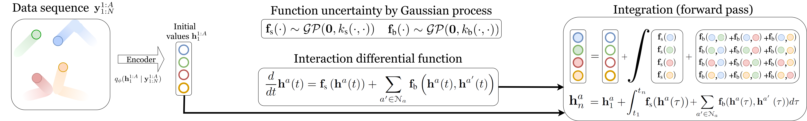

# iGPODE

Pytorch implementation of [Learning Interacting Dynamical Systems with Latent Gaussian Process ODEs](https://arxiv.org/abs/2205.11894) by
[Cagatay Yildiz](https://cagatayyildiz.github.io/), [Melih Kandemir](https://melihkandemir.github.io/) and [Barbara Rakitsch](https://www.bosch-ai.com/research/researcher-pages/t_overviewpage_50.html).

We propose a new method for uncertainty-aware modeling of interactive dynamical system. In a nutshell, our method works as follows:

1. We embed the dynamics into a latent space.
2. Our formulation decomposes the continuous dynamics into independent (autonomous) and interaction dynamics. The first one governs the motion of
an object in isolation, the latter one describes the effects that result from interactions by accumulating messages from neighboring objects. 
3. We place independent GP priors over both components in order to take function uncertainty into account.

## Running the experiments
Requires numpy, matplotlib, torch, gpytorch and TorchDiffEqPack.
Once the libraries are installed, execute runner.py. See the file for parameter options
